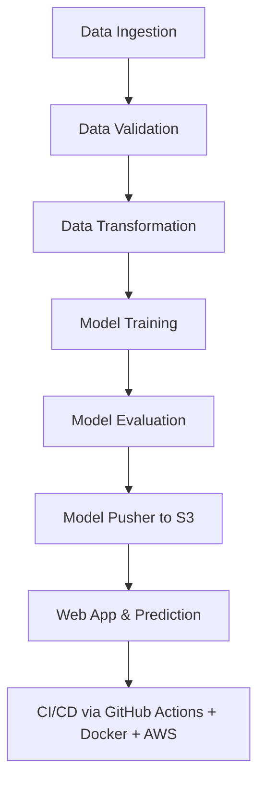

# MLOps Project - Vehicle Insurance Data Pipeline

Welcome to the **Vehicle Insurance Data Pipeline** – an end-to-end MLOps project showcasing how real-world machine learning pipelines are designed, built, deployed, and automated using modern tools and platforms. This project is designed to demonstrate data and model handling by implementing industry-standard CI/CD practices, scalable storage (MongoDB + AWS S3), and seamless deployment on AWS EC2 using Docker and GitHub Actions.

---

## 🌐 Tech Stack

* **Languages**: Python 3.10
* **Data Storage**: MongoDB Atlas, AWS S3
* **Deployment**: Docker, AWS EC2, GitHub Actions
* **Machine Learning**: scikit-learn, pandas, NumPy
* **MLOps Tools**: GitHub Actions, Docker, PyProject, Conda
* **Others**: HTML/CSS (Flask Web UI), YAML config management

---

## 📁 Project Structure and Setup


```
📦vehicle-classification
 ┣ 📂src
 ┃ ┣ 📂components
 ┃ ┣ 📂data_access
 ┃ ┣ 📂aws_storage
 ┃ ┣ 📂configuration
 ┃ ┣ 📂entity
 ┃ ┣ 📂pipeline
 ┃ ┗ 📜utils
 ┣ 📂notebook
 ┣ 📂static
 ┣ 📂templates
 ┣ 📜app.py
 ┣ 📜requirements.txt
 ┣ 📜Dockerfile
 ┣ 📜.dockerignore
 ┣ 📜setup.py
 ┣ 📜pyproject.toml
 ┗ 📜README.md
```

---

### 1️⃣ Project Template Creation

Run `template.py` to automatically generate a clean project structure:

```bash
python template.py
```

This creates all essential modules and files, including:

```
src/
├── components/
│   ├── data_ingestion.py, model_trainer.py, ...
├── configuration/
│   ├── mongo_db_connection.py, aws_connection.py
├── cloud_storage/
├── data_access/
├── entity/
├── pipeline/
├── utils/
├── exception/, logger/
```

---

## 🧰 Environment Setup

### 2️⃣ Local Package Management

Configure `setup.py` and `pyproject.toml` to register local packages. Learn more from `crashcourse.txt`.

### 3️⃣ Create Virtual Environment

```bash
conda create -n vehicle python=3.10 -y
conda activate vehicle
pip install -r requirements.txt
pip list  # verify installations
```

---

## 🍃 MongoDB Atlas Setup

### 4️⃣ Steps to Configure MongoDB Atlas

1. Create an account on [MongoDB Atlas](https://www.mongodb.com/cloud/atlas).
2. Create new **M0 cluster** → Define a user with password.
3. Add IP: `0.0.0.0/0` for access from all IPs.
4. Get the **Python connection string**.

### 5️⃣ Push Dataset to MongoDB

* Create a `notebook/` folder and add your dataset.
* Use `mongoDB_demo.ipynb` to:

  * Load dataset
  * Push to MongoDB
  * Validate data in Atlas → *Browse Collections*

---

## 🧾 Logging, Exception Handling, EDA

### 6️⃣ Logging and Exception Handling

* Add logging logic in `src/logger/__init__.py`
* Add exception logic in `src/exception/__init__.py`
* Test using `demo.py`

### 7️⃣ Perform EDA and Feature Engineering

Use Jupyter notebooks to explore and preprocess data in `notebook/`.

---

## 📥 Data Ingestion Pipeline

### 8️⃣ Data Ingestion Implementation

* Define MongoDB connector in `configuration/mongo_db_connection.py`
* Access and transform data using `data_access/proj1_data.py`
* Configure ingestion in:

  * `entity/config_entity.py`
  * `entity/artifact_entity.py`
* Logic in `components/data_ingestion.py`
* Update constants in `constants/__init__.py`
* Run ingestion via `pipeline/training_pipeline.py`

### 9️⃣ MongoDB URL Setup

```bash
# Bash
export MONGODB_URL="mongodb+srv://<username>:<password>@cluster.mongodb.net"

# PowerShell
$env:MONGODB_URL = "mongodb+srv://<username>:<password>@cluster.mongodb.net"
```

---

## ✅ Data Validation and Transformation

### 🔟 Data Validation

* Schema defined in `config/schema.yaml`
* Implement validation logic in `utils/main_utils.py`
* Add validation logic in `components/data_validation.py`

### 1️⃣1️⃣ Data Transformation

* Transform logic in `components/data_transformation.py`
* Use `entity/estimator.py` for transformation classes

---

## 🧠 Model Training and Evaluation

### 1️⃣2️⃣ Model Training

* Implement model training in `components/model_trainer.py`
* Update estimator utilities in `entity/estimator.py`

### 1️⃣3️⃣ Model Evaluation and Pusher (Needs AWS)

Before continuing, configure AWS...

---

## ☁️ AWS Setup for Model Deployment

### 1️⃣4️⃣ AWS IAM and S3

* Create an IAM User with `AdministratorAccess`
* Generate and download **Access Key & Secret**
* Add credentials as ENV vars:

```bash
# Bash
export AWS_ACCESS_KEY_ID="XXX"
export AWS_SECRET_ACCESS_KEY="XXX"
```

* Add to `constants/__init__.py`:

```python
MODEL_BUCKET_NAME = "my-model-mlopsproj"
MODEL_PUSHER_S3_KEY = "model-registry"
MODEL_EVALUATION_CHANGED_THRESHOLD_SCORE = 0.02
```

### 1️⃣5️⃣ S3 Bucket Creation

* Go to S3 → Create bucket → `my-model-mlopsproj` (Region: `us-east-1`)
* Uncheck “Block all public access”

### 1️⃣6️⃣ S3 Logic

* Write push/pull logic in:

  * `cloud_storage/aws_storage.py`
  * `entity/s3_estimator.py`

---

## 🔮 Model Evaluation & Prediction

### 1️⃣7️⃣ Model Evaluation

* Evaluate new model vs old using logic in `components/model_evaluation.py`

### 1️⃣8️⃣ Model Pusher

* Push the final model to S3 in `components/model_pusher.py`

---

## 🔧 Web UI + Prediction

### 1️⃣9️⃣ Prediction Pipeline

* Add logic to `pipeline/prediction_pipeline.py`
* Implement web backend in `app.py`

### 2️⃣0️⃣ Static and Template Setup

* Add `static/` and `templates/` for Flask UI
* Display prediction outputs via HTML interface

---

## 🔁 CI/CD Automation with Docker, GitHub, EC2

### 2️⃣1️⃣ Docker + GitHub Actions

* Write `Dockerfile` and `.dockerignore`
* Create `.github/workflows/aws.yaml`

### 2️⃣2️⃣ GitHub Secrets

Add the following in GitHub → Settings → Secrets:

* `AWS_ACCESS_KEY_ID`
* `AWS_SECRET_ACCESS_KEY`
* `AWS_DEFAULT_REGION`
* `ECR_REPO`

---

## ⚙️ AWS EC2 & Docker Deployment

### 2️⃣3️⃣ EC2 Setup

* Launch EC2 (T2.medium, Ubuntu 24.04)
* Allow port `5080` in Inbound rules
* SSH into instance

### 2️⃣4️⃣ Install Docker

```bash
curl -fsSL https://get.docker.com -o get-docker.sh
sudo sh get-docker.sh
sudo usermod -aG docker ubuntu
newgrp docker
```

### 2️⃣5️⃣ GitHub Self-Hosted Runner

* GitHub → Settings → Actions → Runner → New Self-hosted Runner
* Follow Linux instructions on EC2

```bash
./run.sh  # To keep runner alive
```

---

## 🚀 Final Deployment

### 2️⃣6️⃣ Trigger CI/CD

* Commit changes → GitHub Action triggers → Docker builds & pushes image → EC2 deploys container

### 2️⃣7️⃣ Access App

* Open browser:

```
http://<EC2_PUBLIC_IP>:5080
```

---

## 🧪 Additional Features

### `/training` Route

Trigger model training from browser.

### GitHub Actions

Full CI/CD integrated. Automates:

* Docker Build
* Push to ECR
* Pull to EC2
* Restart container

---


## 🚀 **End-to-End Project Workflow**

```
                      ┌────────────────────┐
                      │   🔄 Data Source    │
                      │  MongoDB (Atlas)    │
                      └────────┬───────────┘
                               │
                               ▼
                    ┌──────────────────────┐
                    │   📥 Data Ingestion   │
                    │ Pull from MongoDB    │
                    └────────┬─────────────┘
                               │
                               ▼
                   ┌──────────────────────────┐
                   │  ✅ Data Validation       │
                   │ Check schema & integrity │
                   └────────┬─────────────────┘
                               │
                               ▼
                   ┌────────────────────────────┐
                   │  🔃 Data Transformation     │
                   │  Feature engg + Estimators  │
                   └────────┬────────────────────┘
                               │
                               ▼
                     ┌──────────────────────┐
                     │   🧠 Model Training │
                     │  ML Model & Metrics  │
                     └────────┬─────────────┘
                               │
                               ▼
                    ┌────────────────────────┐
                    │  📊 Model Evaluation   │
                    │  Compare & Track Scores│
                    └────────┬───────────────┘
                               │
                               ▼
                    ┌────────────────────────┐
                    │ ☁️ Model Deployment     │
                    │ Push to AWS S3 Bucket   │
                    └────────┬───────────────┘
                               │
                               ▼
             ┌────────────────────────────────────────┐
             │    🧪 Prediction API & Web Interface    │
             │ Flask + HTML/CSS in app.py             │
             └────────┬───────────────────────────────┘
                               │
                               ▼
      ┌─────────────────────────────────────────────────────┐
      │  ⚙️ CI/CD Automation with Docker + GitHub Actions +  │
      │         AWS EC2 & ECR (Self-Hosted Runner)           │
      └─────────────────────────────────────────────────────┘
```

---

## 🧠 **High-Level Stages**

| Phase               | Tooling / Libraries Used                                       |
| ------------------- | -------------------------------------------------------------- |
| **Data Storage**    | MongoDB Atlas                                                  |
| **ETL (Ingestion)** | Pandas, Pymongo, Custom Scripts                                |
| **Validation**      | YAML Schema + Custom Validators                                |
| **Transformation**  | Scikit-learn, Pipelines, Feature Engineering                   |
| **Model Training**  | Scikit-learn, Custom Estimator Wrapper (`estimator.py`)        |
| **Evaluation**      | Threshold Metrics, Historical Comparison                       |
| **Deployment**      | AWS S3, Flask App, `model-registry` folder                     |
| **CI/CD**           | Docker, GitHub Actions, AWS EC2, ECR, Self-Hosted Runner       |
| **Web Interface**   | Flask (`app.py`), HTML Templates (`templates/`), Static Assets |

---

## 🛠️ **Behind the Scenes – Infra & Automation**

* **Dockerized App**: Ensures cross-platform consistency
* **GitHub Actions**: Automates testing, containerization, and push to AWS
* **AWS EC2**: Host for live Flask API
* **AWS ECR**: Private container registry
* **MongoDB Atlas**: Cloud-hosted database for insurance data
* **Custom Exception & Logging Framework**: Centralized logs for debugging

---
## 🎯 Project Workflow Summary



---

## Video Demo
👉 Watch the demo on YouTube: https://youtu.be/o30qj1XNo9s


## 🏁 License

[MIT License](LICENSE)


